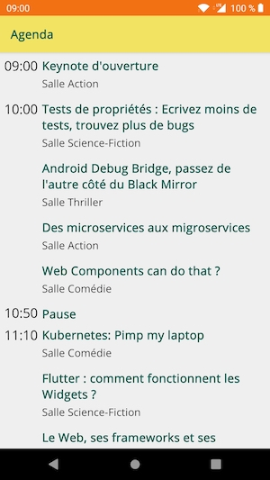
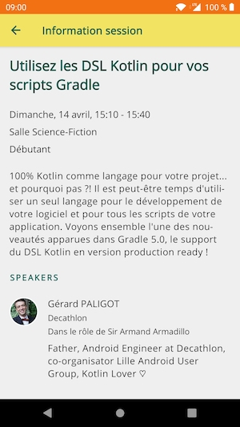

# DevFest Lille Android Application

Android application developed for [DevFest Lille 2019](https://devfest.gdglille.org)
which display agenda of the event and for each session, details about it and list of speakers.

## Talks

* [Gradle + Kotlin DSL = ⚡🚀](https://speakerdeck.com/gerardpaligot/gradle-plus-kotlin-dsl-equals)

## Captures

 

## License

    Copyright 2019 Gérard Paligot

    Licensed under the Apache License, Version 2.0 (the "License");
    you may not use this file except in compliance with the License.
    You may obtain a copy of the License at

       http://www.apache.org/licenses/LICENSE-2.0

    Unless required by applicable law or agreed to in writing, software
    distributed under the License is distributed on an "AS IS" BASIS,
    WITHOUT WARRANTIES OR CONDITIONS OF ANY KIND, either express or implied.
    See the License for the specific language governing permissions and
    limitations under the License.

But API used in this application is all right reserved by [GDG Lille](https://github.com/GDG-Lille) organization.